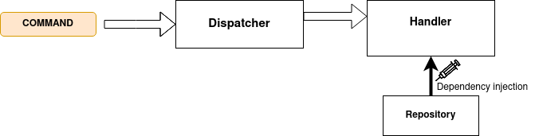
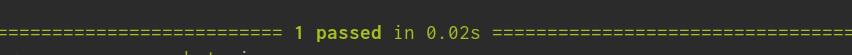
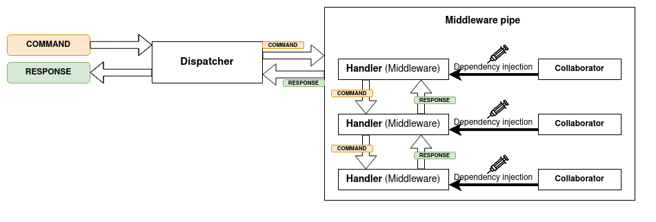

# Part 1: Let's build a CQRS application 

## Where to start: Use cases

When you build a traditional CRUD application, it's common to start
by modeling your database schema.

Either with an ERM (Entity relationship models) modeling tools (as MySQL workbench)
or doing it as code by writing entities using your favorite ORM.

While nothing forbids that in the world of CQRS, __Use Cases__ are
a much better starting point.

This is not a subject of itself. It's many. DDD, BDD, Cucumber...

__The goal of this part is to give you an understanding of CQRS
base concepts. What this is definitely not: a thorough guide on
all the good processes and practices to do that yourself in prod__

(Eventually, that's what that series of articles is meant to be)

So rather than

| __Customer__|
|--------------|

| column | type | 
|--------|------|
| id     | int  |
| email  | varchar(100) |
| address| ... |

(And so on...)

What your first step will look like should more be along the lines of:

> __As a customer I want to add articles to my basket__

(Which could then be declined into several scenarios, on which base you
may write or generate tests. But hey, we're not aiming for prod ready 
processes here. Only the basics of CQRS. So (B|D)DD will have to wait
a later part)

Here come the __C__ and and the __Q__ of __CQRS__.

Uses cases will reflect as interactions with our system

Those interactions will fall in one of two categories:

* __Getting stuff__ (Query)
* __Doing stuff__ (Command)

## What is this part going to be about

We'll start implementing our application.
Yet only to the extent useful to introduce __CQRS__ basic
conceptual blocks.

## Basic concepts
### Interface, Dependency injection
I remember the first time I heard the term __dependency injection__ telling to 
myself __Just based on how the name sounds, that looks like a super advanced concept__

I also remember the very first time I was introduced to the notion of
__Interfaces__ wondering why the heck a weird "empty class that can't contain code"
could help me in anyway.

__This subpart is here to address those question for everyone in those 
shoes right now. If you already know all this, you can skip through DTO__

#### Foreword on Interfaces in Python
Many languages have Interfaces. Python doesn't, but Python is nice 
and let us implement whatever we want, albeit constraints on ourselves.

We'll see in future part how to emulate interfaces with `mypy`. During
this present part, we'll only assume the constraint.

#### Let's start with a real world situation familiar to most devs

It's your first day in a cool Pythonistas company, You're working on a 
project with old, legacy code.

You're asked to change the Database from xxxSQL to xxxNOSQL

Exploring the legacy code, you stumble upon that beauty:

```python
class UserManager:
    def signin(self, user:User):
        if db.exec_query(f"SELECT count(*) FROM user WHERE id='{user.email}'")>0:
            raise UnnecessarilyTypedException(f"A user with email address {user.email} already exists")
        else:
            db.exec_query(f"INSERT INTO user(id, email, password) VALUES(NULL, {user.email}, {user.password})")
    
```

The  first reaction any decent dev should have here is to puke a little.

The second reaction should be to be to remove that ugly strong coupling.

See, that's a toy example. But should it occur in real life, you could expect
all the code to be build that way.

#### What's the problem here ?

Well, aside probable SQL injections, what should really shock you here is
strong coupling. Business logic is written aside technical communication
with the DB layer. To change the DB while keeping the spirit of this code
you'd have to go through every handwritten query. You'd have bugs. Nasty 
and time consuming bugs.

To be extra clear
> Two users can't have the same email address

Is Business logic (kinda, that's arguable. But that's a toy example so just go with it)

> Asking the DB all users with a given email address

Is technical logic.

Whatever the project, whatever the technical stack, those two should never
be side by side in a block of code.

Keyword to remember and google __Responsibility segregation__
                            
#### What to do about it ?
Keep coupling as loose as possible. Don't ever mix business logic and low
level DB stuff (or any low level stuff for that matter)

#### How to achieve that ?
Here's a change we could make to our legacy code:

```python
class UserRepositoryInterface:
    def find_by_email(self, email:str) -> List[User]:
        raise NotImplementedError()

    def create(self, user:User) -> None:
        raise NotImplementedError()
```

First create an Interface. 

__Interfaces__ are contracts. They're saying, "A class that implements me
should have those methods with those signatures"

Then, make `UserManager` use any class with that interface.

```python
class UserManager:
    def __init__(self, repository:UserRepositoryInterface):
        self.repository = repository
```

Where lies the business logic (`UserManager` in our case), should
never, ever be aware of the underlying DB. Only interfaces.

What `UserManager.__init__` is telling us is: __Give me an object that
has methods `find_by_email(self, email:str) -> List[User]` and
`create(self, user:User) -> None`. The rest is none of my concern, I
only care about business logic.

Next step is to move the queries in a class that implements our interface
```python
class UserRepositoryXXXSQL(UserRepositoryInterface):
    def find_user_by_email(self, email:str) -> List[User]:
        ...
        # use db.exec_query(f"SELECT count(*) FROM user WHERE id='{email}'")
        # Init User objects with results and return them as a list
    ...
```

When initializing __UserManager__ in our application, we'll __inject__ 
wanted a dependency, in our case, any given implementation of 
`UserRepositoryInterface`.
```python
user_manager = UserManager(UserRepositoryXXXSQL())
```

__Dependecy Injection__ is just that.

### DTO
A DTO (for Database Transfer Object) is a short lived object meant 
to contain data and carry it (Initially to a Database, but it's common
to refer to objects that fits this definition as DTO eventhough no DB is
involved.

__Note: DTO__ Should be immutables. For the sake of only focusing on our
topic, we'll keep that aspect for a future part.


### Command and Query

A command is simply a __DTO__, that will express an intention and contain data 
needed to perform the action intended. An action is whenever a mutation occurs

A query is pretty much the same thing, except its goal is to access data rather
than inducing a mutation

## Functional concepts

Now we have a broad idea of what Queries and Commands are, we'll tackle concepts
of the architecture we'll use to make them work.

### Handler

A Handler is the function associated with a command or a query (also events,
but that's for our next part)

### Repository

A repository is a class that implements an interface and take care of interactions
with the persistence layer of your application.


## Let's get real

### Use cases

That's it guys we're actually coding our application !

Here are the use cases we'll want to implement in our first iteration:
* As a non-user I want to be able to register an account
* As an user I want to create TodoLists
* As an user with a TodoList, I want to add it tasks
* TodoLists should have:
    * A title
    * A description
    
* Tasks should have:  
    * A title
    * A description
    * A date of creation
    * A date at which the task should be done
    * A data at which MUST be done (which we'll call __deadline__)

We'll stick to that for now :)

(__Actual scenarios__, __Cucumber__. Those are two items that would
make our process real world ready. We'll tackle that in the future.
Just keep in mind world readiness is not what we're aiming yet) 


### Architecture
#### Foreword: How to Interface
For this part, we'll mock the mechanism of Interfaces. We'll rigor
the crap out of it in future parts.

```python
class FooInterface:
    __interface__ = True
    
    def method_signature(self, arg1:type1) -> ReturnedType:
        raise NotImplementedError()
```
#### Requirements and project structure

Create a file named `requirements.txt` with this content
```text
rich
pytest
toolz
flask
flask-login
SQLAlchemy
Flask-SQLAlchemy
psycopg2
werkzeug
```

Then create the project structure
```shell script
python3.8 -m pip install -r requirements.txt

mkdir -p faire/{aggregate,command,query,repository,cqrs,tests,utils}
touch faire/{aggregate,command,query,repository,cqrs,tests,utils}/__init__.py
touch faire/{aggregate,command,query,repository}/user.py
touch faire/aggregate/aggregate.py
touch faire/command/command.py
```

__Quick side note: Aggregates__ are, for now, simple entities. We'll see
in future parts how they're not. What conceptually tell them appart from 
regular entities. For this part, just assume we could have called them 
`Entities`

#### Dependency injector

__Dependency Injection__ is something you need to use and understand thoroughly.

Especially in large applications, it's not always totally simple to use.

here are two hurdles that come with it:

##### Verbosity
If you need to instantiate an object, that depends on an other, that depends on
an other...
```python
my_foo = Foo(BarImplementation(BazImplementation(BlaImplementation())))
```
It gets confusing

##### Single instance
It may happen that you need to use an object on two distinct parts of
your code. And you want to use the SAME object.

It's not that hard to achieve, but many ways to do so will be painful
and prone to bug.

There is a pattern for that, it's called __Dependency Injector__ or
__Dependency Container__

______________
Create the file `faire/utils/dependency_injector.py` with this code:
```python

from typing import Any

class DependencyInjector:
    """
    Dead Simple dependency injector

    Assumption: Only one type and instance per interface
    """

    def register_instance(self, instance: Any, *aliases) -> None:
        pass

    def get(self, cls):
        pass
```

Here's what we want it to do:
> Given FooImpl implementing FooInterface, 
>
> Given BlaRegistery has __FooInterface__ as a dependecy (and signal that fact by type hint)
> 
> assuming foo is an instance of FooImpl an DI of DependencyInjector
>
>
>       
> * If DI.register_instance(foo_impl, 'foo_bar', 'bar_foo')
>   * DI.get(FooInterface) is DI.get(FooImpl) is DI.get('bar_foo') is DI.get('foo_bar') 
>
> In the same scope
> * If DI.get(BlaRegistry) on its first call will return a new instance of 
> BlaRegistry with the correct dependency injected


We have scenarios !
We can write tests

create `faire/tests/dependency_injector_test.py` with this
```python
from faire.utils.dependency_injector import DependencyInjector


def test_DependencyInjector():
    class FooInterface:
        __interface__ = True

    class FooImpl(FooInterface):
        pass

    class BlaRegistry:
        def __init__(self, foo: FooInterface):
            self.foo = foo

    DI = DependencyInjector()
    DI.register_instance(FooImpl(), "foo_bar", "bar_foo")

    assert (
        DI.get(FooInterface)
        is DI.get(FooImpl)
        is DI.get("foo_bar")
        is DI.get("bar_foo")
        is DI.get(BlaRegistry).foo
        is not FooImpl()
    )
```

A last thing

> DependencyInjector implements the `Singleton` pattern.
> DepencyInjector.instance returns always the same instance, which is created if needed

Which translate in test as: (append this to the same file)

```python
def test_DependencyInjectorSingleton():
    assert DependencyInjector.instance is DependencyInjector.instance
```

run in terminal
```python
python3.8 -m pytest faire/tests/dependency_injector_test.py
```

Which should fail. If it doesn't fail, that's in itself a fail
(Wait, would it means it's therefore a success ?)

We'll first take care of the `Singleton` mechanism

create the file `faire/utils/singleton.py` with this
```python
from typing import TypeVar

T = TypeVar("T")


class Singleton(type):
    """
    Dead simple singleton helper
    :use:
    ```python
    class Bla(metaclass=Singleton):
        def __init__(self): # <= Assumes __init__ awaits no parameter
            ...

    Bla.instance <= unique instance of Bla
    """

    @property
    def instance(cls: T) -> T:
        # TODO type hint with generic
        cls._instance = getattr(cls, "_instance", cls())

        return cls._instance
```

then, replace the content of `faire/utils/dependency_injector.py` with
```python
from itertools import cycle
from typing import Any

from toolz import valmap

from faire.utils.singleton import Singleton


class DependencyInjector(metaclass=Singleton):
    """
    Dead Simple dependency injector

    Assumption: Only one type and instance per interface
    """

    def __init__(self):
        self._instances = {}

    def register_instance(self, instance: Any, *aliases) -> None:
        """
        :Note to myself: Perhaps too much magic. TODO: Test limit cases
        """
        for base in instance.__class__.__bases__:
            if getattr(base, "__interface__", False):
                aliases = [*aliases, base]

        aliases = [*aliases, instance.__class__]

        self._instances.update(dict(zip(aliases, cycle([instance]))))

    def _create_instance(self, cls):
        # TODO Type hint with Generics
        self.register_instance(
            cls(
                **valmap(
                    lambda type_: self._instances[type_],
                    cls.__init__.__annotations__,
                )
            )
        )

    def get(self, cls):
        if not cls in self._instances:
            self._create_instance(cls)

        return self._instances[cls]
```

Again run 
```python
python3.8 -m pytest faire/tests/dependency_injector_test.py
```
Which should work

##### Important note
What I'm aiming at, writing this series of articles, is talk to folks in the
shoes I was when I first started code.

Though, there is an hidden purpose behind this dependency injector. Which
is to talk to the version of myself of not so long ago and yell as this idiot
"Dude, that's too much magic".

See, magic in code may be great, but must be handled carefully.

For now this is a mere __not real world ready__ note of caution.
At this point, and for all intents and purposes of that article,
`DependencyInjector` behaviour is just fine.

A future part will address how too much magic auto-wiring may happen 
to be disastrous.


Here's the first bits of code we're going to need
* [ ] API Endpoint
* [x] Base class for Users
* [ ] Base class for Commands
* [ ] Base class for Commands
* [ ] Base class for Handlers
* [x] A User Aggregate
* [ ] An interface for UserRepository
* [ ] A Dispatcher 
* [ ] A Middleware Bus


`faire/aggregate/aggregate.py`
```python
from typing import Callable, NewType, Any
from uuid import uuid4

DefaultFactory = NewType("DefaultFactory", Callable[[], Any])


class Aggregate:
    """Base class for Aggregate with magic"""

    id: uuid4 = DefaultFactory(lambda :uuid4())
    
    def __init__(self, **kwargs):
        for attr_name, attr_type in self.__annotations__.items():
            if attr_name in kwargs:
                setattr(self, attr_name, kwargs[attr_name])
                continue
            if isinstance(attr_type, DefaultFactory):
                setattr(self, attr_name, attr_type())
            if attr_type in (str, int, float):
                setattr(self, attr_name, getattr(self.__class__, attr_name))

```

`faire/aggregate/user.py`
```python

from faire.aggregate.aggregate import Aggregate

class User(Aggregate):
    username: str
    email: str
```

__NOTE__: __⚠__ username and email are typed as __strings__. This is a hugely
bad practice, and those should have their own types (That's where Value Objects
come in). For the sake of simplicity, we'll keep that as a __TODO__. But keep that
in mind.


`faire/command/command.py`
```python
class Command:
    """
    base class for commands
    """
    def __init__(self, **kwargs):
        """
        :param kwargs: 
        Set attr from kwargs
        # Note: This is still yet a toy, non-prod-ready mechanism
        """
        for attr_name in self.__annotations__:
            setattr(self, attr_name, kwargs.get(attr_name))

class CommandHandler:
    """
    Base class for Command Handlers
    :use:
    ```python3
    # Assuming a command FooCommand
    class FooCommandHandler(CommandHandler, listen_to=FooCommand):
        def __init__(self, repository:FooRepositoryInterface):
            self.repository = repository
            
        def handle(self, command:FooCommand):
            ...
    ```
    """
    def __init_subclass__(cls, **kwargs):
        setattr(cls, "listen_to", kwargs.get("listen_to"))
        
    def handle(self, command:Command):
        raise NotImplementedError()

```

Our `Command` class is only used for typing

Command handler's job will be to handle commands (such a reveal :D )
One very important aspect is that command handlers should only have knowledge
of two things:
* The command (duh)
* Interfaces

In our case, the `Commands` that will have to do with __Users__ will only know
about `UserRepositoryInterface`

Let's write this class
`faire/repository/user.py`
```python
from uuid import uuid4
from typing import List

from faire.aggregates.user import User


class UserRepositoryInterface:
    def find_by_id(self, id: uuid4) -> User:
        raise NotImplementedError()

    def get_all(self) -> List[User]:
        raise NotImplementedError()

    def add(self, user: User) -> uuid4:
        raise NotImplementedError()
```

So, I say it again: 
__Handlers should only know they're dealing with an instance of an object
that implements a given Interface__

In other terms, the underlying database, persistance layer, ORM and so on,
those are no the concern of Handlers

`faire/command/user.py`
```python
from faire.aggregate.user import User
from faire.command.command import Command, CommandHandler
from faire.repository import UserRepositoryInterface


class RegisterUser(Command):
    username: str
    email: str


class RegisterUserHandler(CommandHandler, listen_to=RegisterUser):
    def __init__(self, repository: UserRepositoryInterface):
        self.repository = repository

    def handler(self, command: RegisterUser):
        return self.repository.add(
            User(username=command.username, email=command.email)
        )
```

#### Dispatcher

Commands when arriving to our system, should be given to the proper handler

That's what the dispatcher is for.
`faire/cqrs/command_dispatcher.py`
```python
from collections import defaultdict

from faire.command.command import CommandHandler, NullHandler, Command


class CommandDispatcher:
    def __init__(self):
        self.handlers = defaultdict(NullHandler)

    def register_handler(self, handler: CommandHandler):
        self.handlers[handler.listen_to] = handler


    def dispatch(self, command:Command):
        return self.handlers[command.__class__].handle(command)
```


### Where we're at

We have enough elements to do two things:
* Start and have a board overview of our CQRS architecture
* Write some god damn test (It was said with a Texas accent. You can't say because it's text)

#### Architecture overview

Keep in mind we're still on mode "one bit of complexity at a time".
This is not prod ready yet.

Still, we can already write tests, make things happen, and TDD some implementations

Currently, what we have (and what we'll implement with TDD) looks something like this:
 

* __1 )__ Handlers are instanciated, and given their dependencies
    * (Their given instances of classes that implement interfaces they want. 
    In our case, __RegisterUserHandler__ should receive a class that implements
    __UserRepositoryInterface__). By the way, this is called __Collaborator Pattern__

* __2 )__ The dispatcher work is to receive a command and give it to the instance
of __Handler__ that matches its type

##### What questions hasn't been answered yet 
* How to handle authorisation and authentication (and more broadly, everything
inbetween command arriving to our system and its execution)
* How commands are made (essentially, how to make an application out of that,
with an API endpoint and so on)
* Everything about responses
* Pretty much everything about __Queries__

#### Let's write tests

`faire/tests/command_dispatcher_test.py`
```python
from typing import List
from uuid import uuid4, UUID

import pytest

from faire.aggregate.user import User
from faire.command.command import CommandHandler, Command
from faire.command.user import RegisterUserHandler, RegisterUser
from faire.cqrs.command_dispatcher import CommandDispatcher
from faire.repository import UserRepositoryInterface


def get_dispatcher(handler:CommandHandler) -> CommandDispatcher:
    dispatcher = CommandDispatcher()
    dispatcher.register_handler(handler)

    return dispatcher


class MookUserRepository(UserRepositoryInterface):
    """
    Dummy implementation of User repository
    """
    def __init__(self):
        self.users = {}

    def add(self, user: User) -> uuid4:
        user.id = uuid4()
        self.users[user.id] = user
        return user.id

    def find_by_id(self, id: uuid4) -> User:
        try:
            return self.users[id]
        except KeyError:
            raise ValueError(f"No user found with id {id}")

    def get_all(self) -> List[User]:
        return list(self.users.values())

class UnknownCommand(Command):
    """
    A Command our dispatcher should not
    """
    pass

def test_dispatch():

    # We create a handler and inject it with our dummy repository
    repository = MookUserRepository()
    handler = RegisterUserHandler(repository=repository)

    # Then we instanciate our dispatcher
    dispatcher = get_dispatcher(handler)

    # No user exist at this point
    assert repository.get_all() == []

    first_user_id = dispatcher.dispatch(RegisterUser(username="foo", email="bar"))

    # The dispatch should have created a user and returned its id
    assert isinstance(first_user_id, UUID)
    assert len(repository.get_all()) == 1

    # We should be able to retrieve our user
    assert isinstance(repository.find_by_id(first_user_id), User)


    with pytest.raises(ValueError):
        repository.find_by_id(uuid4())

    with pytest.raises(NotImplementedError):
        dispatcher.dispatch(UnknownCommand)
```

```shell script
pytest -s faire/tests/command_dispatcher_test.py
```
 Yay \o/


__❗ Tips__ Pytest's `-s` flag allows you to output stuff when running
tests. Which may come handy for debug.

##### What's next

We have a dispatcher that dispatches. Now we'll want:
* Endpoint with proper communication practices
* An actual UserRepository
* Additionnal bussiness logic to handle

Note that this is only to implement the __Command__ side of things
as you'll see, __Queries__ are pretty much handled in the exact same
way. So the plan is to make our first command work, once mastered
all the concepts involved, implementing queries will be straigthforward.


The first time I tried to build a CQRS archi, I had a hard time finding
a clear answer to this question:

# Where the hell do I handle Auth ?
(Or any system logic for that matter)

Notes: There is no single answer, so the one I'm about to give you
is not the one universal pattern to do it. There is room for creativity


Also, here's an extremely good advice that I wad given years ago (seriously, it's the very best
advice about software that was ever given to me): 
> If you're learning any
kind of software pattern, on personal/toy projects (don't do it in production though)
as soon as you think you gained even a glimpse of understanding, try and implement it yourself.

> You'll make mistakes, and that's the goal. 
>
>The most important thing in software development
and architecture is not to know how to go things right. 
>Rather, it's to know how to avoid doing them wrong. 
>
>Make mistakes, that's how you learn

#### Endpoint
```shell script
echo flask >> requirements.txt&&python3 -m pip install flask
```

#### Midleware
```shell script
mkdir faire/cqrs&&touch faire/cqrs/{__init__,middleware}.py
echo toolz >> requirements.txt&&python3 -m pip install toolz
```

Here's what we want
 


We'll use the lib [toolz](https://toolz.readthedocs.io/en/latest/api.html#toolz.itertoolz.sliding_window)

`toolz.sliding_window` allows us to do this:
```python
from toolz import sliding_window

for a, b in sliding_window(1, [1,2,3,4,5]):
    print(f"a={a}, b={b}")
#a=1, b=2
#a=2, b=3
#a=3, b=4
#a=4, b=5
```

Let's create our mechanism for handling commands with middleware buses instead
of single handlers:

```python
from __future__ import annotations
from typing import List, Union

from toolz import sliding_window

from faire.command.command import CommandHandler


class CommandMiddleware:
    """
    Base class for Command Middlewares
    :use:
    ```python3
    class LoggingTimeHandler(CommandHandler, CommandMiddleware):
          def __init__(self, logger:LoggerInterface):
              self.logger = logger

          def handle(self, command:Command):
              start_time = time()
              response = self.next.handle(command)
              exec_time= time() - start_time
              self.logger.log(f"exec time: {exec_time}")
              
              return response
    """

    def set_next(self, next_: Union[CommandMiddleware, CommandHandler]):
        """
        Sets the handler comming next to create a chain
        :param next_: 
        :return: 
        """
        self.next = next_


class CommandMiddlewareBus:
    """
    Bus, that handle proper execution of middlewares to handle a command

    :use:
    ```python3
    bus = MiddlewareBus([middleware1, middleware2, finalhandler])

    bus.handle(some_command)

    ```
    """

    def __init__(
        self, handlers: List[Union[CommandMiddleware, CommandHandler]]
    ):
        for current_middleware, next_middleware in sliding_window(2, handlers):
            current_middleware.set_next(next_middleware)

        self.handle = handlers[0].handle
```


__TODO__ Expliquer pourquoi ça se comporte comme un handler seul


We have a slight change to make to `CommandDispatcher.register_handler`:
* Rename it to `register_handlers`
* Change its signature so it now expect a list of handlers
* Init a `CommandMiddlewareBus` to wrap our handlers

`faire/cqrs/command_dispatcher.py`
```python
from collections import defaultdict
from typing import List

from faire.command.command import CommandHandler, NullHandler, Command
from faire.cqrs.middleware import MiddlewareBus


class CommandDispatcher:
    def __init__(self):
        self.handlers = defaultdict(NullHandler)

    def register_handlers(self, handlers: List[CommandHandler]):
        bus = CommandMiddlewareBus(handlers)
        self.handlers[bus.listen_to] = bus

    def dispatch(self, command: Command):
        return self.handlers[command.__class__].handle(command)
```

The change implied in `faire/tests/command_dispatcher_test.py`
```python

def get_dispatcher(handler:CommandHandler) -> CommandDispatcher:
    dispatcher = CommandDispatcher()
    dispatcher.register_handlers([handler]) #<== This line

    return dispatcher
```

Running 
```shell script
pytest -s faire/tests/command_dispatcher_test.py
```

should work just fine


__TODO__ Expliquer un peu plus le middleware

#### Test the middleware bus

we'll append this code to `faire/tests/command_dispatcher_test.py`:
```python

class Spy(UserList):
    """
    A simple list we'll append message to, in order to assert
    proper execution order
    """


class SpyMiddleware(CommandHandler, CommandMiddleware):
    """
    A middleware that inform the spy before and after the invokation
    of next middleware in the bus
    """

    def __init__(self, spy: Spy, name: str):
        self.name = name
        self.spy = spy

    def handle(self, command: Command):
        self.spy.append(f"{self.name} before")
        response = self.next.handle(command)
        self.spy.append(f"{self.name} after")

        return response


def test_CommandMiddlewareBus():
    spy = Spy()

    foo_middleware = SpyMiddleware(spy, "foo")
    bar_middleware = SpyMiddleware(spy, "bar")
    baz_middleware = SpyMiddleware(spy, "baz")

    # We create a handler and inject it with our dummy repository
    repository = MookUserRepository()
    handler = RegisterUserHandler(repository=repository)

    # Then we instanciate our dispatcher
    dispatcher = CommandDispatcher()

    dispatcher.register_handlers(
        [foo_middleware, bar_middleware, baz_middleware, handler]
    )

    first_user_id = dispatcher.dispatch(
        RegisterUser(username="foo", email="bar")
    )

    assert spy == [
        "foo before",
        "bar before",
        "baz before",
        "baz after",
        "bar after",
        "foo after",
    ]

    # Insure it works as in the first test
    assert isinstance(first_user_id, UUID)
    assert len(repository.get_all()) == 1
    assert isinstance(repository.find_by_id(first_user_id), User)
```
__Note__: Mocks and test helpers are appended in a dirty way out of
convenience. We'll refacto that and have our mocks in a separate file at some point.


#### Add some DTOs

At this point, we've made a dispatcher that execute middleware in the right
order. If everything goes fine, handling of the command `RegisterUser` should
return us an id (type `UUID`).

Whatever the architecture you're using, values should be wrapped in dedicated 
types, and communication between parts of your system should be done thanks to
dedicated DTO.

Let's do that !

create `faire/cqrs/response.py` and add this code
```python
from typing import List, Any


class Response:
    """
    DTO used to wrap handlers responses
    """

    def __init__(
        self, payload: Any, errors: List[str] = [], infos: List[str] = []
    ):
        self.payload = payload
        self.errors = errors
        self.infos = infos

    def append_error(self, error: str):
        self.errors.append(error)

    def append_info(self, info: str):
        self.infos.append(info)
```

Change accordingly:
the signature of `CommandHandler.handle` in `faire/command/command.py`
```python
    def handle(self, command: Command) -> Response:
```
the signature of `CommandDispatcher.dispatch` in `faire/cqrs/command_dispatcher.py`
```python
    def dispatch(self, command: Command) -> Response:
```
the whole method `RegisterHandler.handle` in `faire/command/user.py`
```python
    def handle(self, command: RegisterUser) -> Response:
        
        id = self.repository.add(
            User(username=command.username, email=command.email)
        )
        
        return Response(payload=id)
```

finally, in `faire/tests/command_dispatcher_test.py`

replace (there is two occurences)
```python
    first_user_id = dispatcher.dispatch(
        RegisterUser(username="foo", email="bar")
    )
```
 by
 ```python
    first_user_id = dispatcher.dispatch(
        RegisterUser(username="foo", email="bar")
    ).payload
```

Don't forget the imports, and run
```shell script
pytest -s faire/tests/command_dispatcher_test.py
```

it should work just fine :) 


#### Register User

It's now time make things actually do something.

Eventually, we'll use `Flask` and `SQLAlchemy`.

For now, since we have everything we need to make user registration process
work, we'll do it in the simplest (also dirtiest) way possible.

Also, since while we're still in the toy project territory, we'll stock our
password in clear text.

Don't ever do that. Just... don't 

first, let's add a `find_by_email` method to `UserRepositoryInterface`
```python
...
class UserRepositoryInterface:
    def find_by_id(self, id: uuid4) -> User:
        raise NotImplementedError()

    def find_by_email(self, email: str) -> User:
        raise NotImplementedError()
    ...
    def commit(self, email: str) -> None:
        raise NotImplementedError()
    
    
    
    
...
```


__NOTE__: only material, TODO: write

```python

class UserRepositorySQLA(UserRepositoryInterface):
    """
    User repository based on SQLAlchemy
    """
    def find_by_id(self, id: uuid4) -> User:
        pass
    
    def find_by_email(self, email: str) -> User:
        pass

    def get_all(self) -> List[User]:
        pass

    def add(self, user: User) -> uuid4:
        pass

    
```

add werkzeug
create command/handler

change commandmidleware to middleware

create hashpasswordinterface et sha256Hasher

create hashpassword middleware

create boostrap.py et init du dispatcher

create register_user_test.py

add that to fixtures
```python
@pytest.fixture(scope="function")
def command_dispatcher():
    from faire.bootstrap import command_dispatcher
    yield command_dispatcher
```

add `password:str` to command `RegisterUser`

changement du handler de registeruserhandler


creation du dependency injector

ajout de __interface__